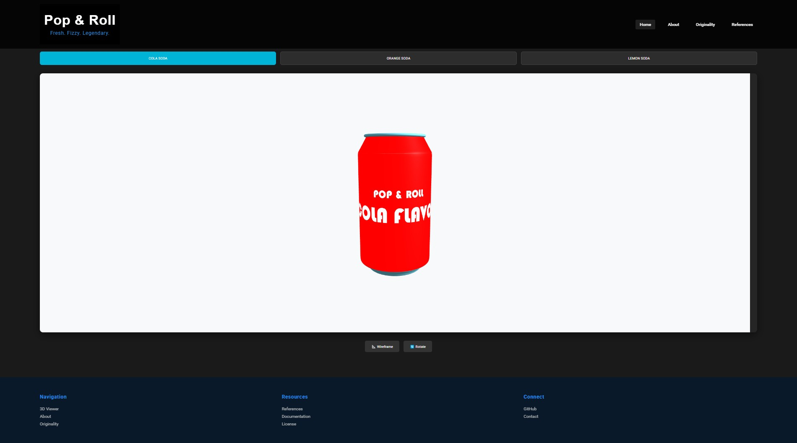

# 🥤 Pop & Roll - 3D Beverage Visualization Platform



A cutting-edge web platform showcasing interactive 3D beverage models with brand-focused packaging design. Built with Three.js and Blender.

[](https://opensource.org/licenses/MIT)
[](https://threejs.org/)

## 🌟 Features
- **Immersive 3D Viewer**  
  Rotate, zoom, and inspect photorealistic beverage models

- **Multi-Model Support**  
  Switch between Cola, Orange, and Lemon soda variants

- **Designer Toolkit**  
  - Wireframe mode visualization 📐
  - Auto-rotation controls 🔄
  - Responsive UI/UX design

- **Brand-Centric Experience**  
  Original packaging design system with CorelDRAW integration

## 🚀 Quick Start
1. Clone repository:

   ```bash
   git clone https://github.com/AbdulRahmanMudasser/three-js-blender-beverages.git